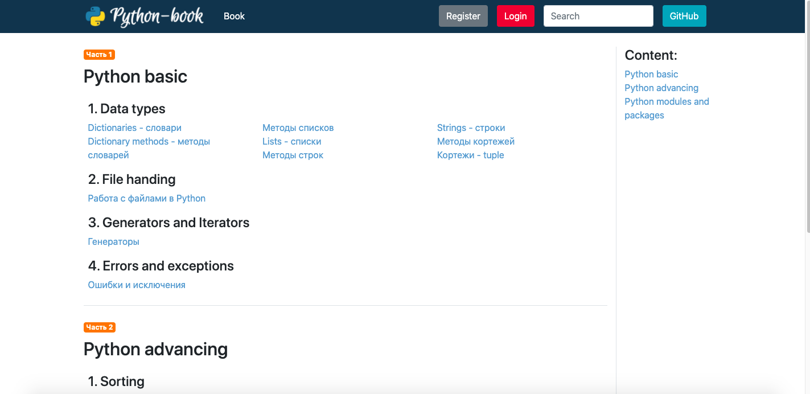

# The pythonBookSite

It's the online book for learning Python. The feature of this project is the articles are structured and have logical order. You can systematize your knowledge of Python.

Reference to source of book content: [github.com/smackov/python-book](https://github.com/smackov/python-book).



#### Reference to the site: [python-book.ru](http://python-book.ru/)

## Technologies used:

* ___Backend___: Python 3.8 / Django 3.x / Django rest framework
* ___Frontend___: React JS / Bootstrap 4.5
* ___System___: nginx 1.8 / Gunicorn / Supervisor / Ubuntu Server
* ___Server host___: Digital Ocean
* ___Database___: PostgreSQL

## Project structure tree

```bash
.
├── pythonBookSite
│  ├── accounts
│  ├── book
│  ├── pythonBookSite
│  ├── frontend
│  └── manage.py
├── readme_assets
├── .babelrc
├── .gitignore
├── README.md
├── package-lock.json
├── package.json
├── requirements.txt
└── webpack.config.js
```
